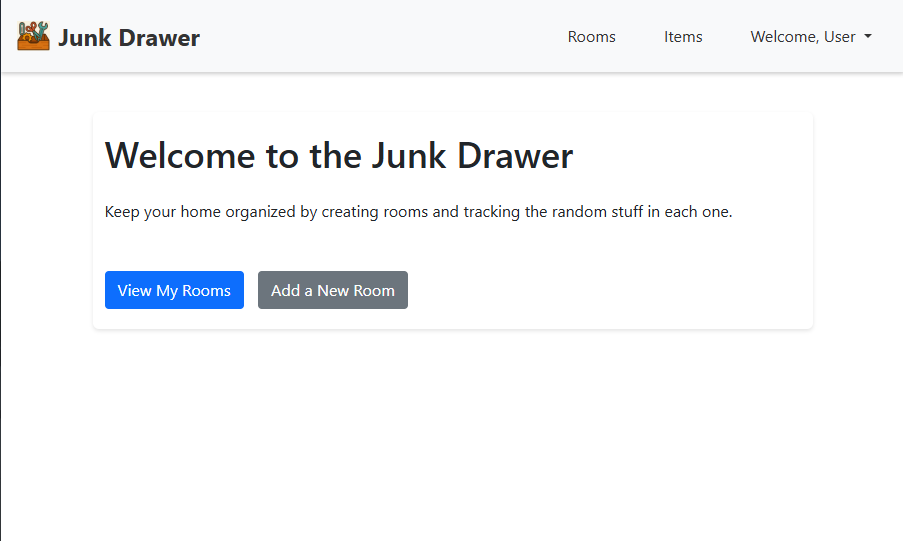

# Junk Drawer App

  
*A minimalist home organization tool to keep track of the little things you always lose.*

---

## About the App

**Junk Drawer** is a full-stack CRUD web application that helps users track household items by organizing them into rooms—think of it as a digital version of the chaotic catch-all drawer in every home.

Each user can:

- Sign up and log in
- Create rooms (e.g., Kitchen, Bathroom, Garage)
- Add, edit, and delete items stored in each room

The idea came from our team’s experience constantly losing everyday tools and gadgets around the house. We built this app as part of a General Assembly Django project to explore full-stack development, teamwork, and scalable app design.

---

## Getting Started

###  Live App

[Visit the Deployed App](https://junk-drawer-app-1b15c6153bee.herokuapp.com/)

### Planning Materials

- [Trello Board](https://trello.com/b/S9VG9FDz/junk-drawer)
- [GitHub Repo](https://github.com/Cpreza24/django-junk-drawer)

### To run locally

```bash
git clone https://github.com/Cpreza24/django-junk-drawer.git
cd django-junk-drawer
pipenv install
pipenv shell
python3 manage.py runserver
```

---

## Technologies Used

- Python 3  
- Django  
- PostgreSQL  
- HTML5 / CSS3  
- JavaScript  
- Bootstrap  
- Trello (project management)  
- Heroku (deployment)

---

## Next Steps / Stretch Goals

1. **Tags**  
   Add optional tags to items for easier filtering and organization  
   _Examples: tools, tech, emergency, kitchenware, toiletries, clothes_

2. **Search & Sort**  
   Implement the ability to search across all rooms and sort items by room

3. **Responsive Design**  
   Improve mobile usability and overall visual layout

4. **Image Uploads**  
   Enable users to attach images to their items for better identification

---

## Built By

- Cesar Preza  
- Isaac Jean Baptiste  
- Onye Iwuorie  
- Matt Mendez Zugenbuehler
